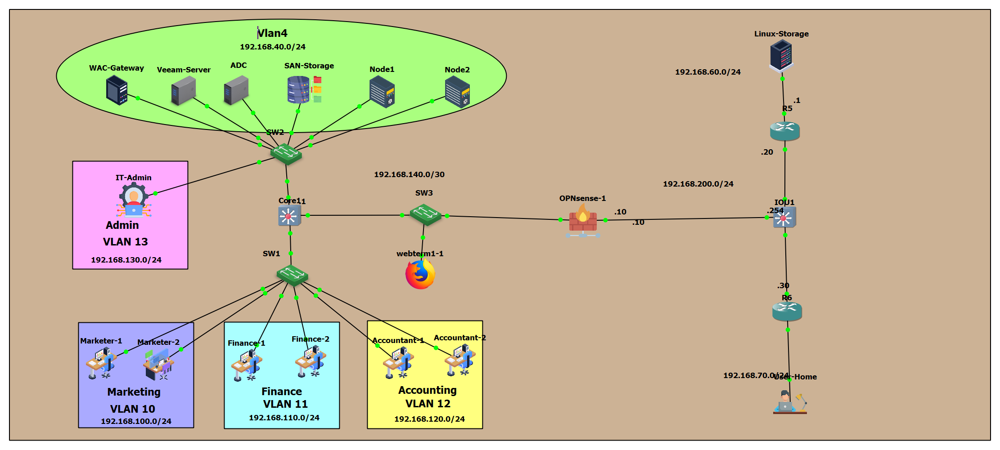

# Enterprise High-Availability Infrastructure, Secure Hybrid Networking & Disaster Recovery Architecture

## 📌 Project Overview
This project represents a full-scale deployment of a highly available, secure, and resilient enterprise-grade infrastructure lab. The architecture integrates multi-tier switching, specialized firewall routing, virtualized shared storage networks (SAN), high-availability application clustering, and robust offsite disaster recovery strategies. 

The lab simulates a modern corporate enterprise workflow, focusing on continuous service availability, strict security access lines, automated group policies, and immutable backup orchestration.

---

## 🗺️ Network & Infrastructure Architecture



### 🏷️ Network Design Specifications
* **Core Switching:** Layer 2/3 architecture utilizing **VLANs**, **802.1Q Trunking**, and **Switched Virtual Interfaces (SVIs)** for optimal inter-VLAN routing and security boundary control via Core11.
* **Perimeter Defense:** **OPNsense Firewall** deployed as the primary edge device, managing NAT rules, internal stateful inspections, and core cryptographic VPN endpoints.

---

## 🛡️ Technical Components & Layer Breakdown

### 1. Identity & Central Management Layer
* **Active Directory Domain Services (AD DS):** Deployed on a dedicated Windows Server Domain Controller (`zfood.local`) controlling enterprise authentication, security principals, DNS resolution, and global administrative structures.
* **Windows Admin Center (WAC) Gateway:** Implemented as a centralized web-based management portal to securely monitor, configure, and maintain all internal servers and client machines remotely.

### 2. High Availability & Shared Storage Layer
* **Oracle SAN Storage:** Configured as the central block-storage array, presenting high-performance shared Logical Unit Numbers (LUNs) to the cluster layout over dedicated storage paths.
* **Windows Failover Clustering (2-Node Architecture):**
  * **Clustered Roles:** Engineered to support a highly available **File Server** and **DHCP Server** dynamically managed across two redundant active/passive nodes (Node1 & Node2).
  * **Storage Mapping:** Cluster volumes and quorum dynamics utilize block storage carved directly out of the central Oracle SAN array.

### 3. Client Policy & Automation Layer
* **Centralized GPO Automation:** Custom group policies deployed to execute automated **Folder Redirection** (e.g., `Documents` & `Desktop`), seamlessly transferring local user profiles into highly available shares hosted on the File Server Cluster.

### 4. Enterprise Backup & Disaster Recovery (DR) Strategy
* **Veeam Backup & Replication Core:** Orchestrates automated enterprise-grade backup copy jobs and retention schedules.
* **Primary (Internal) Repository:** High-speed data storage carved directly from the Oracle SAN array for immediate local recovery capabilities.
* **Secondary (Offsite/Immutable) DR Repository:** Deployed on an isolated **Ubuntu Server** acting as an **External Linux Hardened Repository**. This setup leverages immutable flags (`chattr +i`) to safeguard backup files against ransomware threats or internal infrastructure compromises.

### 5. Secure Hybrid Connectivity & Cryptography
* **Site-to-Site VPN (Branch Office Hook):** An encrypted **IPsec Tunnel** engineered between an external **Cisco Router** and the core **OPNsense Firewall** using strong IKEv2 phase parameters and ESP encapsulations to securely bridge multi-site environments.
* **Remote Access VPN (Road Warrior Setup):** High-performance **WireGuard Tunnel** terminated on the OPNsense Firewall. This grants remote corporate users instant, secure, and low-latency access to domain resources directly from outside the local area network.

---

## 📋 Logical Addressing & Protocol Blueprint

| Network Segment / Service | IP Address / Subnet | Interface / Gateway Reference | Host Protocol Rules / Role |
| :--- | :--- | :--- | :--- |
| **Server Infrastructure LAN (VLAN 4)** | `192.168.40.0/24` | VLAN 4 SVI Gateway / Core11 | Core AD, Node1, Node2, Storage, Veeam, WAC |
| **Clustered File-Server for genneral use Virtual IP** | `192.168.40.115` | Dynamic Virtual Pointer | High-Availability File Server IP Assignment |
| **Clustered DHCP Virtual IP** | `192.168.40.16` | Dynamic Virtual Pointer | High-Availability DHCP IP Assignment |
| **Marketing Network (VLAN 10)** | `192.168.100.0/24` | VLAN 10 SVI / Core11 | End-user Nodes & Workstations (Marketer) |
| **Finance Network (VLAN 11)** | `192.168.110.0/24` | VLAN 11 SVI / Core11 | End-user Nodes & Workstations (Finance) |
| **Accounting Network (VLAN 12)** | `192.168.120.0/24` | VLAN 12 SVI / Core11 | End-user Nodes & Workstations (Accountant) |
| **IT Administration (VLAN 13)** | `192.168.130.0/24` | VLAN 13 SVI / Core11 | Core Management & Admin Nodes (Admin) |
| **Inter-Switch Link (Core to OPNsense)**| `192.168.140.0/30` | Core11 <--> SW3 <--> OPNsense-1 | Core internal transit routing and packet flow |
| **OPNsense WAN / Transit Network** | `192.168.200.0/24` | OPNsense-1 (.10) <--> IOU1 (.254)| External edge transit for secure VPN tunnels |
| **Disaster Recovery DR Site Network** | `192.168.60.0/24` | Connected via R5 / IOU1 | Offsite DR Storage Location (Linux-Storage) |
| **Remote User Home Network** | `192.168.70.0/24` | Connected via R6 / IOU1 | Remote road warrior workers / Home nodes |

---

## 🛠️ Real-World Engineering Triumphs & Troubleshooting Log

A critical portion of this deployment involved diagnosing and neutralizing advanced systems and network infrastructure anomalies. Below are the core issues resolved during production testing:

### 💥 Challenge 1: Multi-Homed Routing & Metric Collisions
* **Symptom:** A dual-homed user machine containing interfaces in both network `40.0` (`40.105`) and network `110.0` (`110.3`) failed to ping the remote branch network interface `110.1`. The Windows networking stack erroneously pushed packets through the network `110.0` gateway due to automatic metric calculations, causing packet drops.
* **Resolution:** Engineered a persistent classless static route forcing the Windows kernel to push remote branch traffic through the correct infrastructure interface:
```
cmd
  route -p add 192.168.110.0 mask 255.255.255.0 192.168.40.254
```
💥 Challenge 2: MTU Fragmentations & Switch Logging Overhead (%LINK-4-TOOBIG)
Symptom: Core Cisco switches flooded console logs with %LINK-4-TOOBIG warnings during high-throughput backup replication cycles. This was caused by standard 1500-byte packets expanding to 1518+ bytes due to 802.1Q VLAN Tagging headers across Trunk links.

Resolution: Performed deep validation of the Windows stack MTU limits using:

```PowerShell
netsh interface ipv4 show subinterfaces
```
After confirming server metrics were locked at 1500 bytes to preserve iSCSI performance, console event aggregation logging rules were muted on standard switch ports to suppress non-critical warning overhead while maintaining line-rate packet forwarding.

💥 Challenge 3: Cluster Resource Lockups (Online Pending Deadlock)
Symptom: The Cluster-DHCP virtual instance crashed into an Offline state, while the associated Clustered Virtual IP and Cluster Disk 4 (Oracle SAN LUN) froze indefinitely in an Online Pending state during multi-node switchovers.

Resolution: Traced the deadlock to an active SAN SCSI reservation lock bound to the secondary node. Cleared execution flags via administrative Failover Cluster resource commands, isolated the storage paths on the primary owner node, forced a clean resource release, and synchronized the DHCP server role binaries across both nodes to restore normal operations.

💥 Challenge 4: Encrypted Traffic Analysis & Wireshark Debugging
Symptom: Intermittent tunnel drops occurred across cross-site boundaries, requiring granular traffic analysis while separating control planes from spanning-tree and routing redirects.

Resolution: Built strict, multi-protocol compound capture display filters within Wireshark to isolate underlying IPSec Encapsulating Security Payload (ESP) headers and WireGuard UDP transport blocks concurrently in a single pane:

```Plaintext
udp.port == 51820 or esp
```
🏁 How to Verify & Inspect This Setup
Domain Integrity: Execute gpupdate /force on any client endpoint; accept the logoff prompt Y to allow the Folder Redirection extension to safely build root paths on the Clustered File Server.

Cluster Failover: Manually migrate the Cluster-DHCP role between Node1 and Node2 using Failover Cluster Manager; verify zero downtime in IP allocation leases.

Backup Immutability: Attempt to manually delete a backup file directly from the Ubuntu repository shell terminal; verify that the Linux Hardened kernel blocks the operation with an access denied warning (chattr +i protection).
