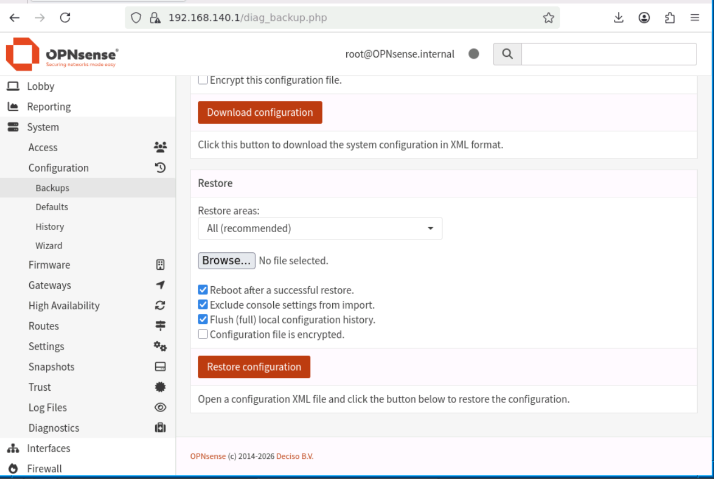

# OPNsense Core Firewall: Configuration Backup & Restore Documentation

This repository folder contains the unified, structural configuration state file (`OPNsense-backup.xml`) representing the entire active security infrastructure, interface assignments, firewall filters, and critical routing rules deployed across the enterprise edge node.

---

## 📋 Configuration File Identity & Metadata

The embedded XML configuration baseline locks down the core system configurations:

* **Target Hostname:** `OPNsense`
* **Infrastructure Domain Mapping:** `internal`
* **Admin Group Definition:** System Administrators (`admins`) bound to elevated permissions.
* **Core Integrations Contained:** * Full layout of Interface routing vectors.
  * Static Routing table entries and specialized System Tunables.
  * Structural configuration parameters for the **Site-to-Site IPsec VPN** and **Remote Access WireGuard VPN** tunnels.

---

## 🛠️ Step-by-Step Configuration Restore Procedure

To recover or migrate this structural deployment state to a fresh or secondary OPNsense firewall instance, execute the following disaster recovery procedure:

### Step 1: Navigating to the Backup & Restore Module
1. Access the secure OPNsense Web UI management console via an authenticated administrator session.
2. Locate the primary system tools column on the left sidebar navigation tree.
3. Drill down to: **System > Configuration > Backups**.

---

### Step 2: Uploading and Mapping the XML Payload
1. Inside the configuration management panel, navigate down to the **Restore** section block.
2. Click on the **Choose File** (أو Browse) option under the restoration path.
3. Select the local repository deployment configuration file named **`OPNsense-backup.xml`**.

> 💡 **Advanced Administration Note:** If you only need specific components (e.g., only restoring Firewall Rules or VPN Profiles without changing the current system hostname or network interfaces), you can select a targeted component from the **Restore Area** dropdown menu. Leave it at **"All"** for a full bare-metal structural recovery.

---

### Step 3: Executing the Configuration Commit
1. Click on the **Restore Configuration** button to commit the XML payload to the active system cache.
2. The firewall daemon will automatically cross-reference the structural integrity of the uploaded backup file.
3. The firewall will trigger an automated programmatic **System Reboot** sequence to initialize all software daemons, routing targets, and cryptographic services cleanly.

---

## ⚠️ Post-Restoration Validation Checklist

Once the appliance boots back online successfully, perform these baseline checks to audit the deployment:
1. Verify interface MAC/Hardware mappings under **Interfaces > Assignments** if migrating to differing hardware nodes.
2. Navigate to **VPN > IPsec > Status Overview** and **VPN > WireGuard > Handshakes** to verify that cryptographic tunnels automatically re-establish communication targets.
