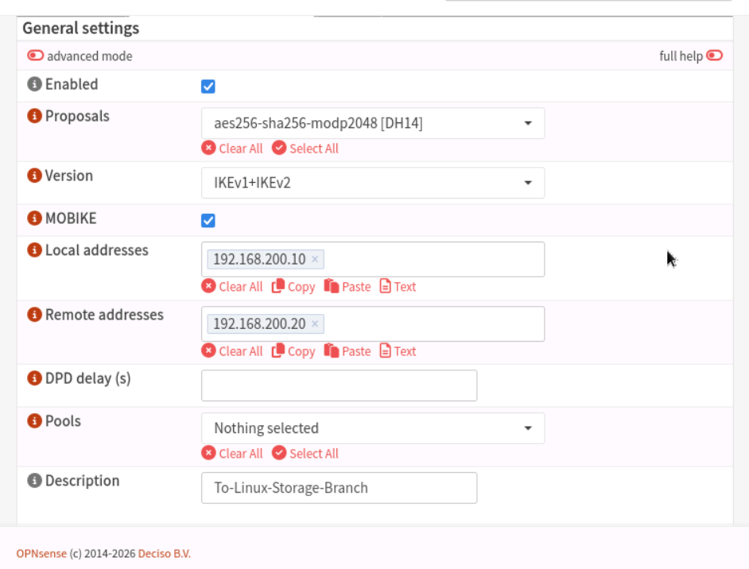
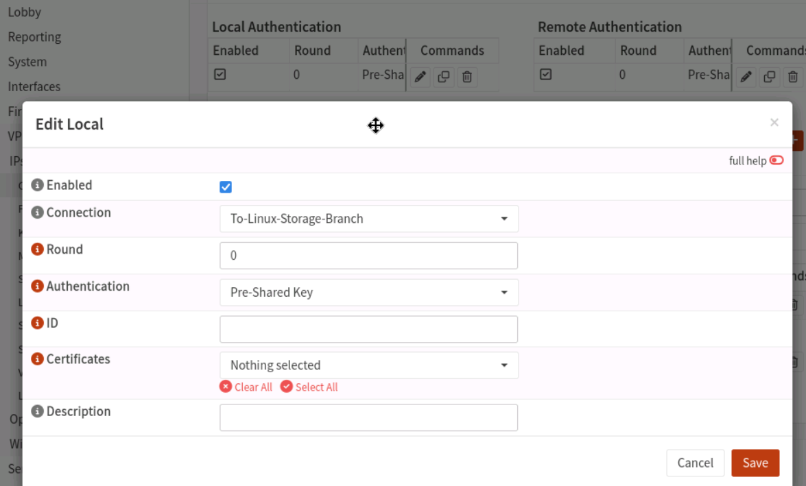
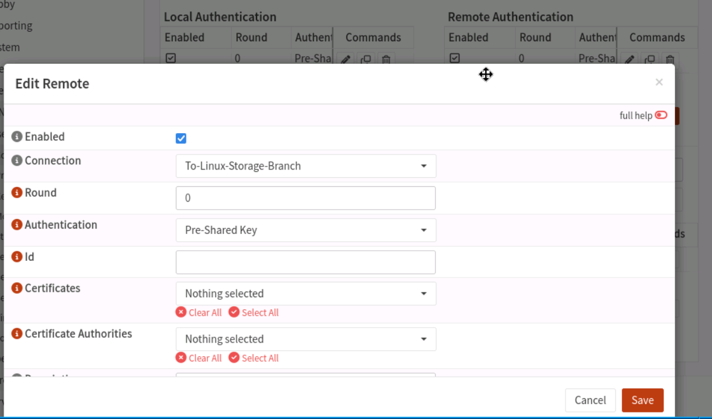
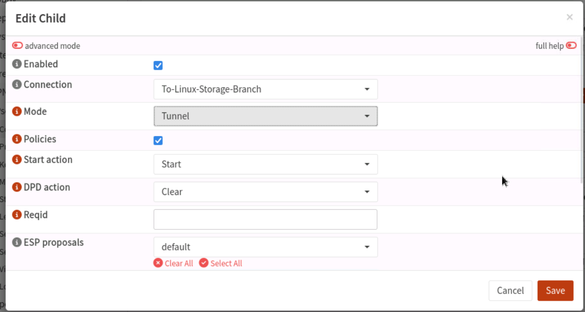
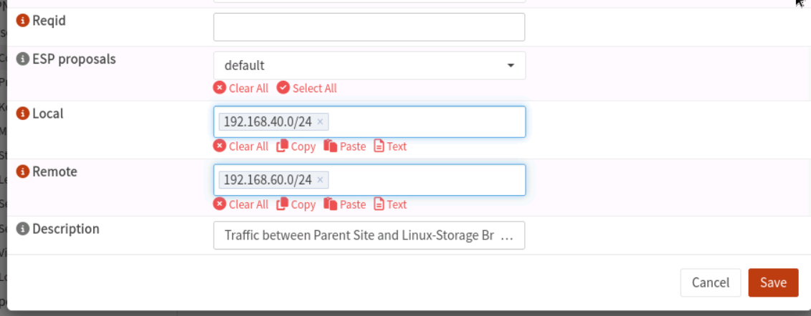
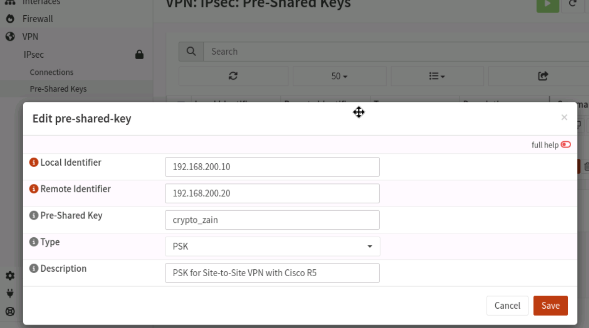
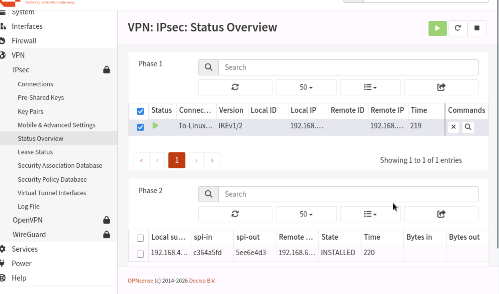

# OPNsense Edge Firewall: Site-to-Site IPsec VPN Architecture

This section documents the engineering deployment of a secure, hardware-accelerated **Site-to-Site IPsec VPN tunnel** using **IKEv2** protocols. This infrastructure link bridges the primary internal corporate production network with the remote offsite data storage facility managed behind **Router 5**.

---

## 🏛️ Network Interconnect Specifications
* **OPNsense WAN Gateway Endpoint:** `192.168.200.10`
* **Router 5 WAN Gateway Endpoint:** `192.168.200.20`
* **Local Production Subnet (Protected LAN):** `192.168.40.0/24`
* **Remote Offsite Subnet (Storage Network):** `192.168.60.0/24`
* **Cryptographic Preshared Key (PSK):** `crypto_zain`

---

## ⚙️ Step-by-Step OPNsense Gateway Configuration

### Step 1: Initialize New Connection Parameters
1. Navigated to **VPN > IPsec > Connections** and initiated a **New Connection** deployment.
2. Configured the **General Settings** layer to implement **IKEv2** connection hosting and enabled administrative tracking.



3. Defined **Local Authentication** constraints, explicitly assigning the node identifier mapping to the local WAN routing path.



4. Mapped the **Remote Authentication** gateway boundaries, specifying the target destination point corresponding to the offsite router interface.



5. Configured the **Children (Phase 2)** policies, establishing structural encryption selectors to securely link the local subnet block (`192.168.40.0/24`) directly to the remote repository block (`192.168.60.0/24`).




---

### Step 2: Provision Cryptographic Pre-Shared Keys (PSK)
1. Navigated to **VPN > IPsec > Pre-Shared Keys** and deployed a new security configuration entry.
2. Bound the unique secret passphrase identifier (`crypto_zain`) directly against the authenticated target gateway string.



---

## 💻 Step-3: Router 5 Cisco IOS Command-Line Architecture

The matching cryptographic profiles, transform-sets, and access-control boundaries were executed on the upstream remote router instance to establish programmatic tunnel alignment:

```text
configure terminal
!
! Phase 1: IKEv2 Cryptographic Proposal and Policy Definition
crypto ikev2 proposal IKE2_PROP
 encryption aes-cbc-256
 integrity sha256
 group 14
exit
!
crypto ikev2 proposal IPSEC_PROP
 encryption aes-cbc-256 aes-cbc-128
 integrity sha256 sha1
 group 14
exit
!
crypto ikev2 policy IPSEC_POL
 proposal IPSEC_PROP
exit
!
! Phase 1: Keyring Mapping and Preshared Secrets Mapping
crypto ikev2 keyring IPSEC_KEYRING
 peer OPNSENSE_FIREWALL
  address 192.168.200.10
  pre-shared-key crypto_zain
 exit
exit
!
! Phase 1: IKEv2 Integration Profile Matrix
crypto ikev2 profile IKEv2_PROF
 match identity remote address 192.168.200.10 255.255.255.255
 identity local address 192.168.200.20
 authentication remote pre-share
 authentication local pre-share
 keyring local IPSEC_KEYRING
exit
!
! Phase 2: Transform-Set Payload Specifications
crypto ipsec transform-set ESP_AES256_SHA256 esp-aes 256 esp-sha256-hmac
 mode tunnel
exit
!
crypto ipsec profile IPSEC_PROF
 set transform-set ESP_AES256_SHA256
 set ikev2-profile IKEv2_PROF
exit
!
! Phase 2: Crypto Map Construction and ACL Interest Binding
crypto map CMAP_TO_OPNSENSE 10 ipsec-isakmp
 set peer 192.168.200.10
 set transform-set ESP_AES256_SHA256
 set ikev2-profile IKEv2_PROF
 match address VPN_TRAFFIC_ACL
exit
!
! Defining Crypto Routing Vectors and Interest Traffic Lists
ip access-list extended VPN_TRAFFIC_ACL
 permit ip 192.168.60.0 0.0.0.255 192.168.40.0 0.0.0.255
exit
!
ip route 192.168.40.0 255.255.255.0 192.168.200.10
!
! Interface Cryptographic Integration Binding
interface FastEthernet0/0
 ip address 192.168.200.20 255.255.255.0
 duplex full
 crypto map CMAP_TO_OPNSENSE
exit
!
! Exit Configuration Mode & Save
end
write memory
```

---

## 📊 Phase 4: Security Verification & Tunnel Status Overview

To audit connection state compliance, cryptographic synchronization logs are tracked live from the monitoring panel.

* Navigated to **VPN > IPsec > Status Overview** to ensure active security parameters.
* **Tunnel State:** Confirmed active established pathways (**`ESTABLISHED`**) running securely over IKEv2.
* **Active Child Security Associations:** Dynamic confirmation tracking payload delivery across security boundaries.


