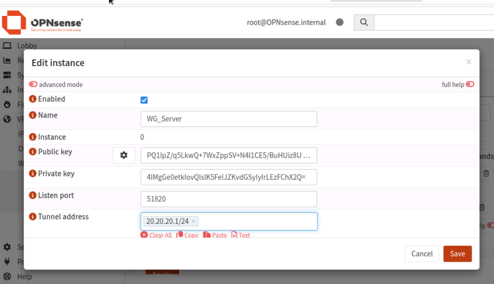
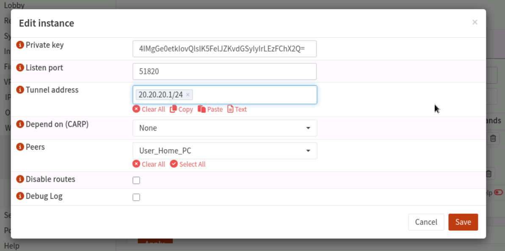
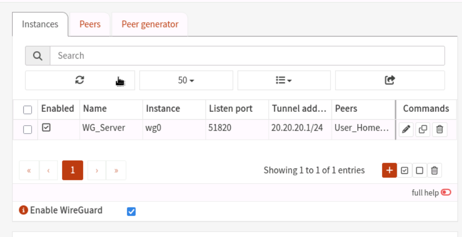
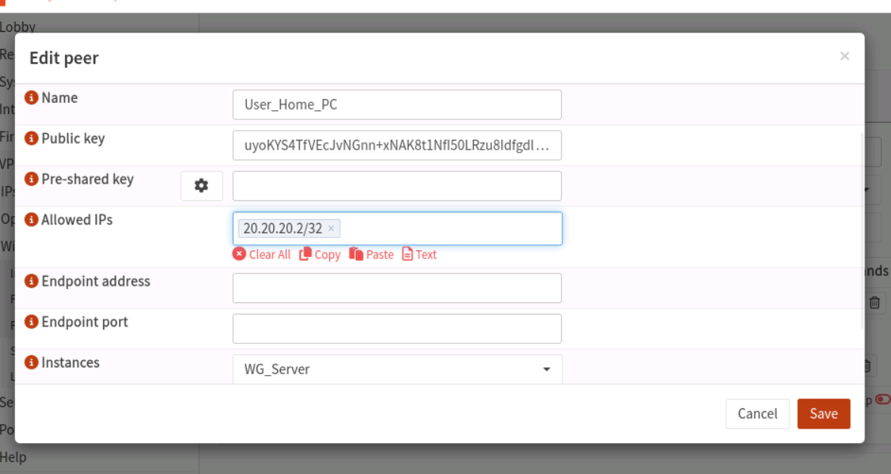
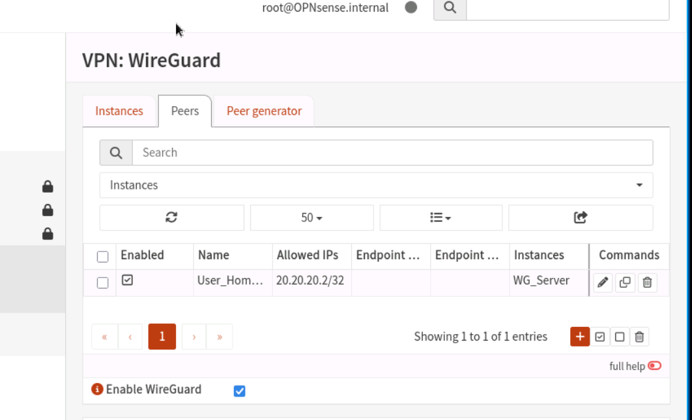
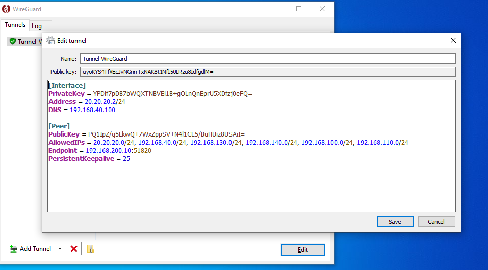
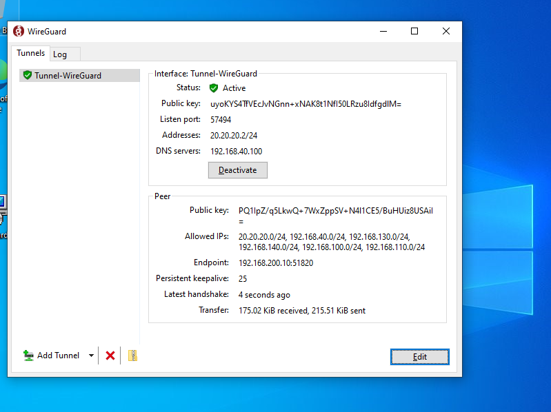
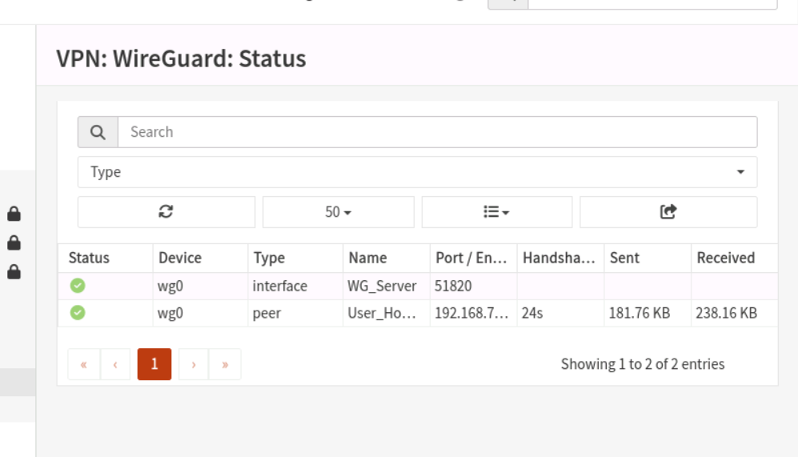

# OPNsense Edge Firewall: Remote Access WireGuard VPN Infrastructure

This section documents the engineering deployment of a high-performance, low-latency **WireGuard Remote Access VPN tunnel**. This infrastructure allows remote administrative clients (`user-home`) to securely cross perimeter boundaries and connect directly to the internal corporate Active Directory domain and local fabric assets.

---

## 🏛️ VPN Network Parameters & Specifications
* **WireGuard Server Tunnel Subnet:** `20.20.20.0/24`
* **OPNsense Gateway Endpoint Tunnel IP:** `20.20.20.1`
* **Remote Client Allocated IP (`user-home`):** `20.20.20.2/32`
* **Allowed Core Subnets (Client-Side Access):** `192.168.40.0/24` (Corporate Domain Segment)
* **Listen Management Port:** `51820`

---

## ⚙️ Step-by-Step OPNsense Gateway Configuration

### Step 1: Provisioning the Local WireGuard Instance (Server Setup)
The instance acts as the local cryptokey endpoint routing daemon on the edge gateway.
1. Navigated to **VPN > WireGuard > Instances** and initiated a **New Instance** profile.
2. Configured the core metrics, specifying the interface listening port (`51820`) and assigning the structural network block (`10.10.10.1/24`).
3. Generated the unique server cryptographic keypairs (Public Key / Private Key exchange).

4. Saved and committed the configurations to establish an active, listening server instance daemon.

---

### Step 2: Defining Remote Client Handshakes (Peer Definitions)
To allow inbound authentication, the explicit tracking parameter of the remote node must be mapped to the server array.
1. Navigated to **VPN > WireGuard > Peers** and selected **Add Peer**.
2. Bound the peer definition directly to the primary local server instance, assigning the remote client's public key generated on the host app.
3. Allocated the static tunnel endpoint identifier (`10.10.10.2/32`) inside the **Allowed IPs** section to isolate endpoint traffic.

---

## 💻 Step 3: Remote Client Integration (`user-home` Configuration)

The endpoint configuration was executed within the standalone WireGuard client utility on the remote endpoint machine.
1. Initialized a new tunnel profile interface mapping the inbound transit rules.
2. Specified the host endpoint parameters, identifying the public WAN address of the OPNsense firewall, and defined the allowed corporate routing vector (`192.168.40.0/24`).

---

## 📊 Phase 4: Bi-Directional Tunnel Verification & Status Oversight

Once cryptographic keys synchronized across both sites, a continuous, encrypted stateful connection was verified.

### 1. Verification from Remote Client App
The tracking client engine confirms absolute state synchronization, recording ongoing keep-alive parameters and successful handshake returns:

### 2. Verification from OPNsense Core Firewall Console
Navigated to **VPN > WireGuard > Handshakes** or List View to cross-reference data transfer rates:
* **Endpoint Status:** Confirmed real-time cryptographic handshakes running between endpoints.
* **Packet Transfer:** Dynamic logs verify ongoing byte encapsulation across the secure network fabric.

---

> 📝 **Architectural Implementation Note:** Extended system configurations—including designated system gateways, static routing vectors, and outbound interface firewall rules necessary for this tunnel—are fully scripted and preserved. They are available for inspection within the centralized OPNsense repository folder under: `/all-backup-config/`.
