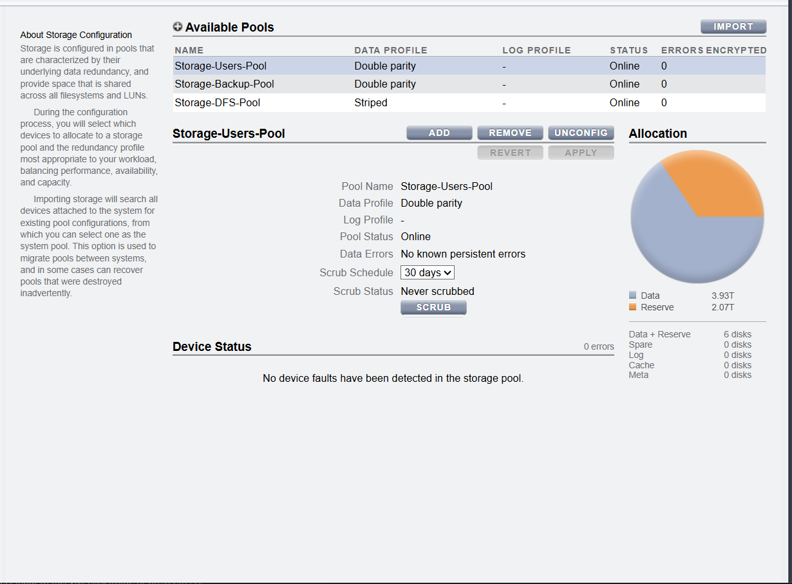

# Oracle ZFS Storage Appliance: Step-by-Step SAN Storage Provisioning Blueprint

This document outlines the step-by-step engineering process implemented within the **Oracle ZFS Storage VM** management environment to provision high-performance block storage (SAN) via iSCSI for production data and disaster recovery orchestration.

---

## 🚀 Phase 1: Storage Pool Creation & Data Redundancy
To establish structural data integrity, virtual storage capacity was distributed across dedicated hardware pools equipped with strict parity protection profiles.

### Implemented Pools Layout:
* **`Storage-Users-Pool`**: Configured using a **Double parity** data profile to securely back up high-availability operational shares and enterprise quorum mappings with dynamic `30 days` scrub scheduling.
* **`Storage-Backup-Pool`**: Configured with a **Double parity** layout to serve as the high-capacity secondary replication site.
* **`Storage-DFS-Pool`**: Deployed as a high-speed **Striped** infrastructure framework for volatile file distribution tasks.

---

## 🔐 Phase 2: Defining Target & Initiator Groups
To enforce cryptographic access control boundaries over the SAN network fabric, discrete host mappings were established to isolate individual server requests.

### Initiator Group Mapping:
1. **`Windows-Cluster` Group**: Explicitly encapsulates the unique IQN endpoints for both physical nodes to grant shared disk orchestration rights:
   * **Node1:** `iqn.1991-05.com.microsoft:node1.zfood.local`
   * **Node2:** `iqn.1991-05.com.microsoft:node2.zfood.local`
2. **`init-backup-repo` Group**: Maps external replication points directly into target arrays (`veeam_server` & `ubuntu`).

---

## 💾 Phase 3: LUN Provisioning & Block-Volume Carving
Once security borders and underlying storage arrays were established, individual **LUNs (Logical Unit Numbers)** were carved out and linked to the target groups.

### 1. Storage Users Pool Assignment
Two dedicated logical volumes were provisioned under the primary operations project:
* **`LUN_Quorum`**: Deployed with a precise `1G` allocation footprint to manage Failover Clustering state voting dynamics.
* **`LUN_Users_Storage`**: A massive `3.93T` high-performance block space engineered to host decentralized production folders.

### 2. Storage Backup Pool Assignment
* **`LUN-backup`**: Formatted with a `4.69T` structural volume density to support immutable copy blocks from Veeam replication workflows.

---

## 📊 Phase 4: Dynamic Appliance Analytics & Dashboard Oversight
Real-time resource utilization, hardware cycles, and active file sharing protocols are continuously tracked to ensure baseline operational stability.

The appliance tracking cockpit monitors critical system behaviors, highlighting stable processing footprints:
* **Hardware Lifecycle**: Active uptime verification confirming `Up 3d 02:24` core continuity.
* **Active Protocol Daemons**: Real-time traffic inspection for active **iSCSI** and **SMB2** operations across host nodes.

