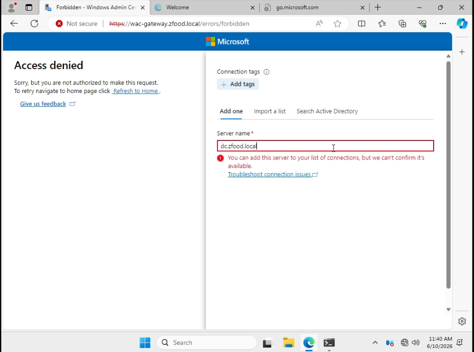

# Troubleshooting Documentation

## Issue 1: Failed to Add Server in Windows Admin Center (WAC) Due to Account Permissions

### Description
When attempting to add a new server (such as `dc.zfood.local`) inside the **Windows Admin Center** interface, a connection confirmation error occurs, accompanied by an "Access Denied" message in the background.

### Error Messages
* **In the Add Server panel:** 
  > `You can add this server to your list of connections, but we can't confirm it's available.`
* **In the background page:** 
  > `Access denied: Sorry, but you are not authorized to make this request.`

### Cause
This issue occurs because the **Windows Admin Center (WAC)** was installed or is being run under a **Local Account** instead of a **Domain Admin Account**. As a result, the application lacks the necessary privileges to query and authenticate against servers within the active directory domain.

### Screenshot

---

### Resolution
1. Log out of the current local session.
2. Ensure that Windows Admin Center is run or re-configured using a credential that belongs to the **Domain Admins** group.
3. Try adding the server `dc.zfood.local` again after authenticating with the proper domain administrator account.
