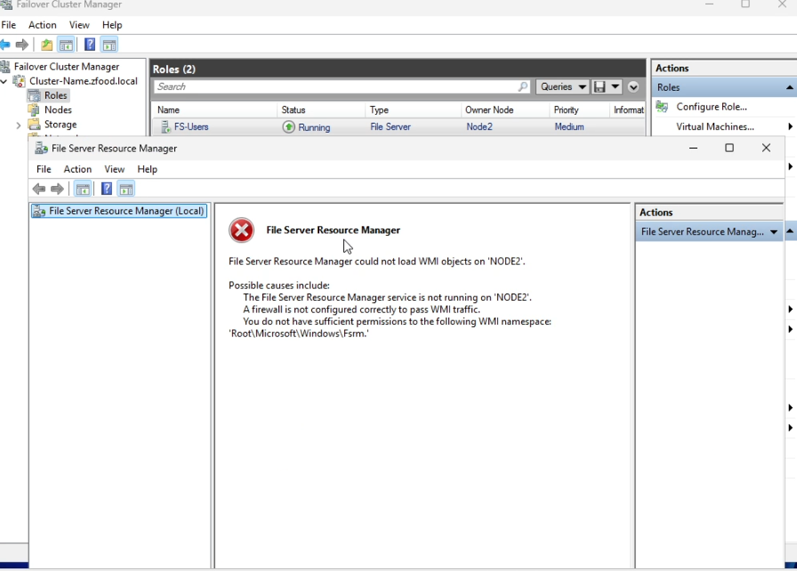

## Issue 4: FSRM Management Console Fails to Load WMI Objects on Cluster Nodes

### Description
When launching or interacting with the **File Server Resource Manager (FSRM)** console on a specific cluster node (such as `NODE2`), the management snap-in fails to populate configuration schema data and blocks administrative tasks with a structural WMI validation error.

### Error Messages
* **In the FSRM Management Window Panel:**
  > `File Server Resource Manager could not load WMI objects on 'NODE2'.`
* **Listed Critical Causes:**
  * *The File Server Resource Manager service is not running on 'NODE2'.*
  * *A firewall is not configured correctly to pass WMI traffic.*
  * *You do not have sufficient permissions to the following WMI namespace: 'Root\Microsoft\Windows\Fsrm'.*

### Cause
This infrastructure degradation typically stems from two operational root errors:
1. **Service State Failure (SrmSvc Daemon):** The core service background process (**`SrmSvc`**) is stopped, or failed to initialize automatically during the high-availability failover cluster node convergence.
2. **WMI Repository Inconsistency:** During active node transitions, Windows Server occasionally loses registry bindings or sync mappings to the specific FSRM WMI repository namespace (`Root\Microsoft\Windows\Fsrm`), requiring a structural reload.

### Screenshots
* **The Error State (FSRM Console Block):**


---

### Resolution & Remediation Script
To clear the repository lock and restore management sync, execute the following configuration recovery sequence on the affected cluster node:

#### Step 1: Force Restart and Automate the FSRM Service
Open an elevated **PowerShell** prompt (**Run as Administrator**) directly on the failing cluster node, then execute the following block to enforce permanent automatic startup behaviors and trigger a forced daemon refresh:

```powershell
# 1. Configure the FSRM service startup type to Automatic to persist across node reboots
Set-Service -Name SrmSvc -StartupType Automatic
```

```powershell
# 2. Force terminate and restart the service to refresh WMI object infrastructure
Restart-Service -Name SrmSvc -Force
```
