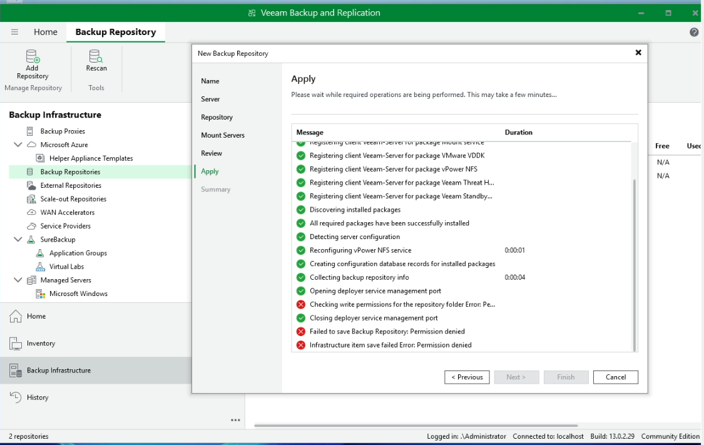

## Issue 6: Veeam Hardened Repository Deployment Fails with Permission Denied on Linux Storage

### Description
When attempting to add or configure a **Linux Hardened Repository** (Immutability Backup Storage) within the **Veeam Backup & Replication** infrastructure console, the application setup wizard hangs at the deployment phase and fails with permission restriction errors during the repository folder write check.

### Error Messages
* **In the Veeam Backup Repository Wizard Apply Panel:**
  > `Checking write permissions for the repository folder Error: Permission denied`
  > `Failed to save Backup Repository: Permission denied`
  > `Infrastructure item save failed Error: Permission denied`

### Cause
This block occurs due to strict security access controls (POSIX permissions) configured on the destination Linux backup server directory (e.g., `/mnt/veeam_repo`). Veeam utilizes a non-root dedicated service account (such as `veeam_admin`) to maintain immutable architecture security. If the target storage mount path on Linux is owned by `root` or lacks explicit write/execute flags for the Veeam service user, the remote agent configuration handshake will fail baseline write authorization checks.

### Screenshots
* **The Error State (Veeam Wizard Permission Denied Drop):**


---

### Resolution & Linux Target Remediation
To clear the repository write restriction, log into the remote Linux backup server terminal via SSH or console and modify ownership and directory properties:

#### Step 1: Assign Directory Ownership to Veeam Admin User
Execute the `chown` command recursively (`-R`) to transition file system owner boundaries from root to your dedicated backup management identity profile:
```bash
sudo chown -R veeam_admin:veeam_admin /mnt/veeam_repo
```
#### Step 2: Grant Full Operational Permissions (Chmod Validation)
Apply proper directory permissions to ensure the service account can read, write, and execute scripts contextually within the repository storage structure seamlessly:

```bash
sudo chmod 755 /mnt/veeam_repo
```

> **Note:** `755` provides full control (`rwx`) to the `veeam_admin` owner user, while maintaining secure read/execute (`r-x`) structural access profiles for assigned groups and other system identities.

#### Step 3: Re-trigger the Veeam Repository Wizard
Return to your **Veeam Backup & Replication** server management workspace dashboard, navigate back to the **Apply** tab of the *New Backup Repository* setup wizard deployment screen, and click **Next** or **Retry**. The platform will pass the remote directory write validation test instantly and finalize all production environment deployment configurations.
