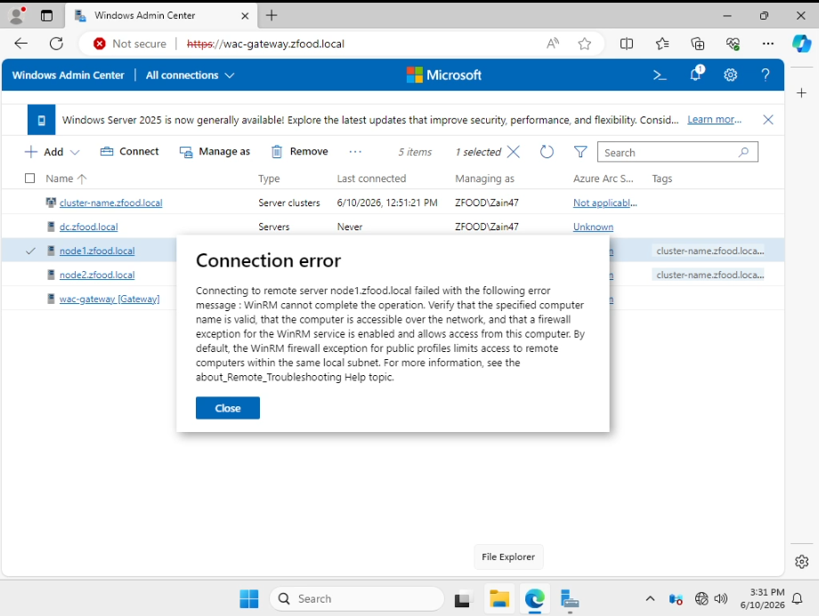

## Issue 2: WinRM Connection Error When Accessing a Powered-Off Target Device / Server

### Description
When attempting to connect to or manage any remote server or device managed instance via the **Windows Admin Center (WAC)** dashboard, a connection failure prompt intercepts the interface indicating a WinRM operation timeout.

### Error Messages
* **In the Connection Error Panel:**
  > `Connecting to remote server <Target_Server_FQDN> failed with the following error message: WinRM cannot complete the operation. Verify that the specified computer name is valid, that the computer is accessible over the network, and that a firewall exception for the WinRM service is enabled and allows access from this computer.`

### Cause
This diagnostic flag surfaces primarily due to one of two structural operational states:
1. **Physical/Virtual Power State (Primary Cause):** The target managed machine (e.g., Domain Controller, Member Server, or Cluster Node) is fully powered off, suspended, or shut down, rendering its network interface cards (NICs) unresponsive to inbound management queries.
2. **Network/WinRM Listener Layer:** The target endpoint's WinRM (Windows Remote Management) listener daemon service is inactive, or enterprise firewall profiles are dropping incoming traffic packets over standard management ports `5985` (HTTP) / `5986` (HTTPS).

### Screenshot


---

### Resolution & Diagnostic Steps
To resolve the connectivity drop, verify and cycle the infrastructure state using the following network order of operations:

1. **Verify Power & Host Hypervisor State:**
   * Access your physical hardware console or the virtualization host manager (Hyper-V / Proxmox / ESXi) to ensure that the target destination operating system is fully booted and in a **Running** state.
2. **Perform Basic ICMP Reachability Check:**
   * Open a command prompt shell from the WAC gateway machine and execute a verification ping test to rule out DNS resolution issues or dead path routes:
     ```cmd
     ping <Target_Server_IP_or_FQDN>
     ```
3. **Validate WinRM Listener Status on Target Machine:**
   * If the system is verified as powered on but remains unreachable, log into the target OS instance directly and audit the WinRM management framework status using PowerShell:
     ```powershell
     Get-Service -Name WinRM
     winrm quickconfig
     ```
4. **Audit Local Windows Defender Firewall Policies:**
   * Ensure that the active Domain/Private firewall profiles on the destination server explicitly permit the predefined inbound communication rules for **Windows Remote Management (HTTP-In / HTTPS-In)**.
