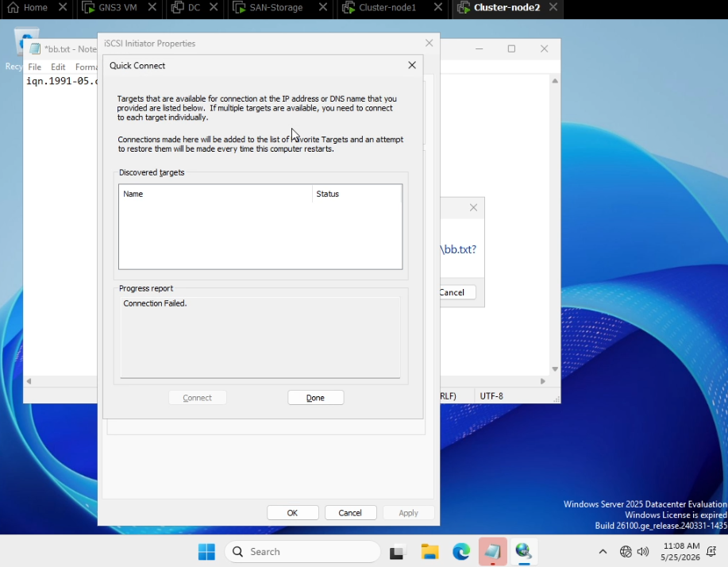
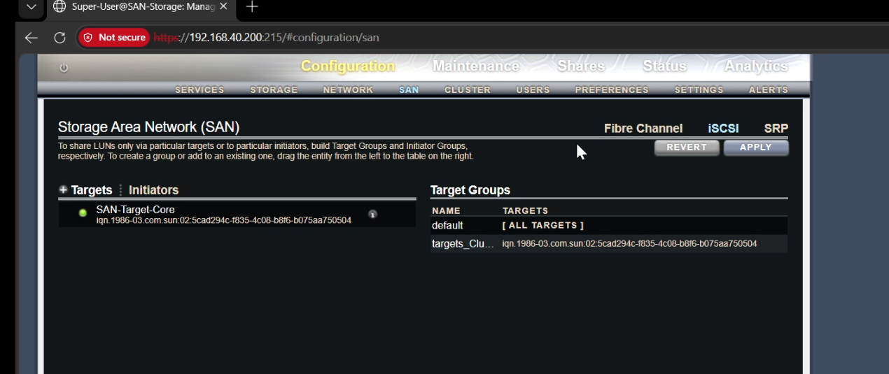

## Issue 3: iSCSI Initiator Connection Failure Due to Default Target Group Restrictions

### Description
When attempting to use the Windows Server **iSCSI Initiator** via "Quick Connect" to map block-storage volumes from the **Oracle ZFS SAN Storage** array, the connection phase hangs and returns a generic failure notification under the progress report.

### Error Messages
* **In the iSCSI Initiator Properties Wizard:**
  > Progress report: `Connection Failed.`

### Cause
This block occurs because of the access control structure defined on the Oracle ZFS Storage appliance. By default, when creating iSCSI Targets, if the discovery or structural mapping relies strictly on the **`default` Target Group** (which utilizes an open wildcard `[ ALL TARGETS ]`), security policies or target grouping filters on the SAN might prevent proper negotiation with the initiator node. The initiator fails to resolve a direct explicit path to its designated logical unit number (LUN).

### Screenshots
* **The Error State (Windows Server Initiator Drop):**

* **The Resolution State (Oracle ZFS SAN Grouping Customization):**

---

### Resolution & Architectural Workaround
To fix this routing restrictions error, the storage administrator must drop reliance on global generic mappings and isolate the target parameters explicitly:

1. **Access Oracle ZFS Storage Appliance:** Log into the web console management page (e.g., `https://192.168.40.200:215`).
2. **Navigate to SAN Configuration:** Go to **Configuration > SAN > iSCSI**.
3. **Isolate Target Explicitly:** * Do not rely on the generic `default` target bundle. 
   * Create a dedicated Target Group (e.g., `targets_Cluster`) and explicitly bind the specific IQN target string associated with your infrastructure volumes (e.g., `iqn.1986-03.com.sun:02:5cad294c-f835-4c08-b8f6-b075aa750504`) directly inside it.
4. **Apply Changes:** Click **APPLY** on the Oracle ZFS panel to enforce the strict group assignment policy.
5. **Re-trigger iSCSI Initiator:** Return to the Windows Server node, input the target portal IP, and execute the discovery connection. The handshake will now authenticate successfully, showing an **Connected** status instantly.
