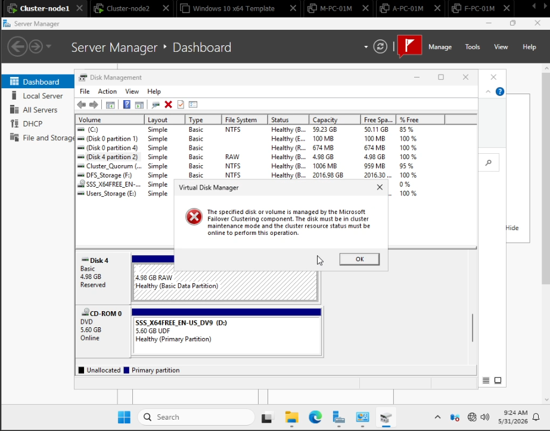
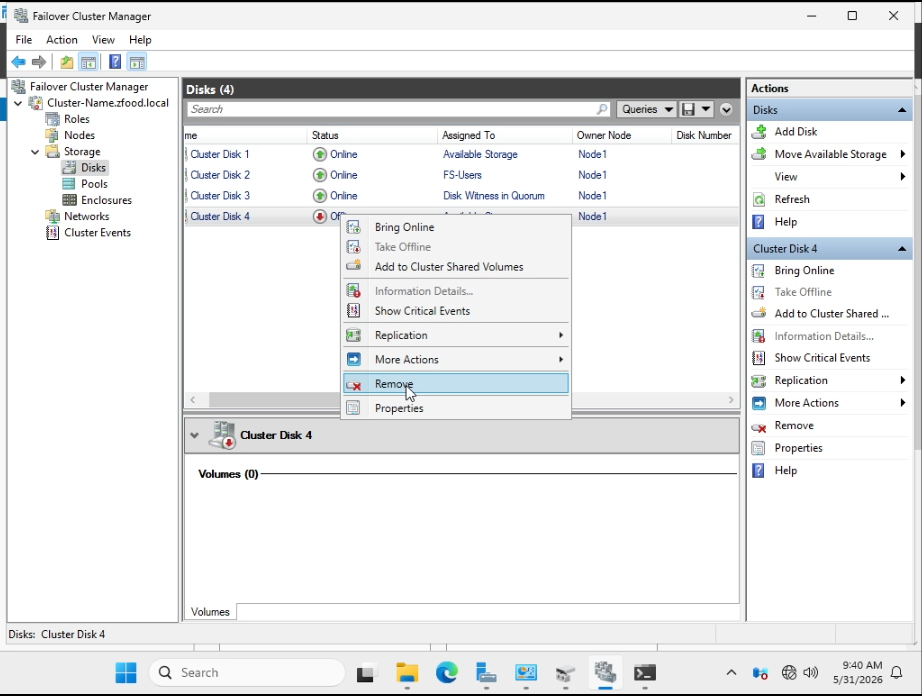

## Issue 5: Disk Management Blocked by Failover Clustering Component Permissions

### Description
When attempting to modify, format, initialize, or mount a shared SAN disk (such as `Disk 4`) directly from the standard Windows **Disk Management** console (`diskmgmt.msc`), the system blocks the action and prompts a Virtual Disk Manager restriction dialog.

### Error Messages
* **In the Virtual Disk Manager Pop-up:**
  > `The specified disk or volume is managed by the Microsoft Failover Clustering component. The disk must be in cluster maintenance mode and the cluster resource status must be online to perform this operation.`

### Cause
This operational restriction occurs because the target disk has already been provisioned and added as an active storage resource component within the **Failover Cluster Manager**. Once the clustering database registers a disk under its administrative control, it locks the volume signature to guarantee multi-node data integrity. This lock prevents native disk management snap-ins from executing structural operations (like format or partition configuration changes) unless the resource is dropped from the cluster pool or switched into a maintenance profile.

### Screenshots
* **The Error State (Disk Management Blocked Profile):**

* **The Resolution State (Dropping the Resource from Failover Cluster):**

---

### Resolution & Management Workaround
To release the cluster configuration lock and regain full format and staging control over the disk resource from Disk Management, apply the following cluster maintenance steps:

#### Step 1: Remove the Locked Storage Resource from Cluster Control
1. Launch the **Failover Cluster Manager** console (`cluadmin.msc`).
2. Expand your active cluster tree navigation (e.g., `Cluster-Name.zfood.local`) and select **Storage > Disks**.
3. Locate the locked disk instance (e.g., `Cluster Disk 4` showing an Offline or Available Storage state).
4. Right-click the target disk entry and select **Remove** from the contextual drop-down menu.
5. Confirm the action when prompted to delete the resource from the cluster database (Note: This *does not* delete data off your SAN LUN, it simply unregisters the path from the cluster controller).

#### Step 2: Provision and Format the Raw Disk Volume
1. Open the traditional **Disk Management** panel on the primary server node.
2. `Disk 4` will now display as a standard independent basic raw disk, completely unlocked.
3. Right-click the raw volume or unallocated partition, select **Format** or **New Simple Volume**, assign your preferred file system architecture (such as **NTFS**), and click format.

#### Step 3: Re-add the Freshly Configured Volume back to the Cluster
1. Once formatting completes and the disk mounts successfully on the local node, return to **Failover Cluster Manager > Storage > Disks**.
2. Under the right-hand **Actions** sidebar panel, click on **Add Disk**.
3. Select the freshly formatted volume checkbox instance and click **OK** to re-introduce the disk into the high-availability resource infrastructure workspace.
