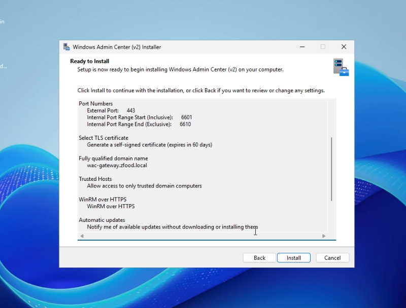
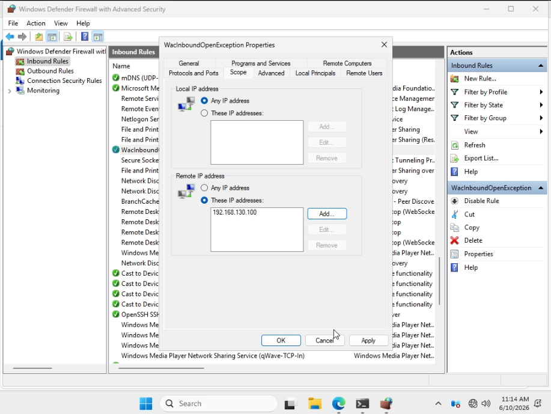
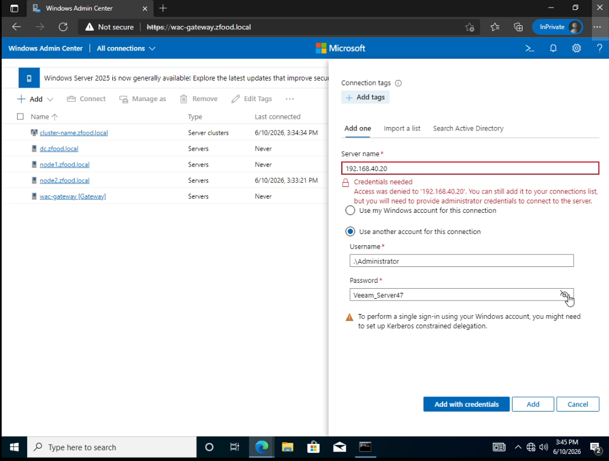
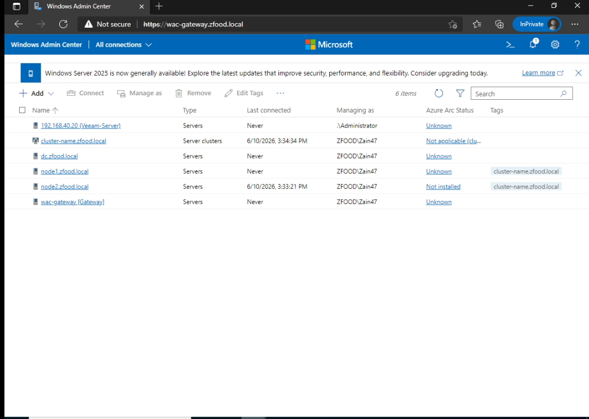
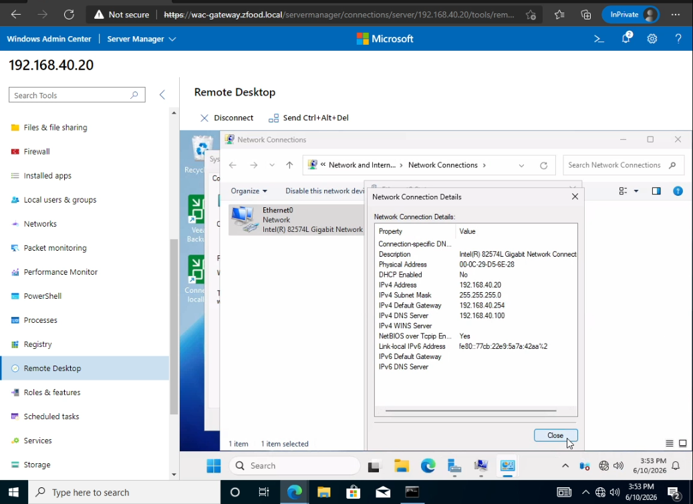

# Windows Admin Center (WAC) Gateway Deployment & Infrastructure Management

This section documents the deployment of **Windows Admin Center (WAC)** acting as a centralized, web-based management gateway to monitor and administrate hybrid Windows Server nodes, cluster roles, and non-domain joined endpoints from a single secure interface.

---

### Step 1: Installing Windows Admin Center (WAC) Gateway
The gateway setup initializes the core web services and binds the traffic to secure communication ports.
* Executed the standalone **Windows Admin Center installer** on the designated gateway instance.
* Configured the installation parameters, including port selection (`443` or alternative management ports) and generated the self-signed SSL certificate options to encrypt browser sessions.

---

### Step 2: Access Control & Security Boundaries (Determine Who Accesses WAC)
To protect the core infrastructure, strict entry restrictions must be enforced at the gateway level.
* Defined the explicit security groups, user roles, or IP conditions allowed to authenticate against the Windows Admin Center gateway web interface.
* This setup isolates management operations, ensuring only authorized system administrators can access the broader server environment.

---

### Step 3: Managing Non-Domain Joined Nodes via Local Credentials
Windows Admin Center allows the administration of workgroup computers or machines outside the `zfood.local` domain perimeter by leveraging localized administrative tokens.
* Initialized the connection configuration for targets not joined to the primary Active Directory domain.
* Supplied explicit **Local Administrator credentials** (`.\Administrator`) to authenticate and establish a secure WinRM remote management channel.

---

### Step 4: Centralized Inventory Overview (Devices Added to WAC)
Once the connection nodes pass authentication criteria, they are mapped into a single unified workspace catalog.
* The centralized console displays a full operational inventory list of all successfully added server instances, failover clusters, and client machines.
* Administrators can instantly view connection status, domain mapping parameters, and cluster member roles across the infrastructure.

---

### Step 5: Advanced Node Administration & Resource Monitoring (The Device Overview Panel)
*(Note: The correct technical term in WAC is the **Overview / Server Tools Panel**).*
Selecting an individual node pivots the view into an active diagnostics workspace, replacing legacy MMC tools.
* **Real-Time Diagnostics**: Displays hardware utilization metrics including active **CPU** cycles, **Memory** pressure, and network throughput charts.
* **Integrated Server Tools**: Provides deep granular control over internal OS layers including registry modifications, local user accounts, active certificate paths, device managers, and events tracking.

