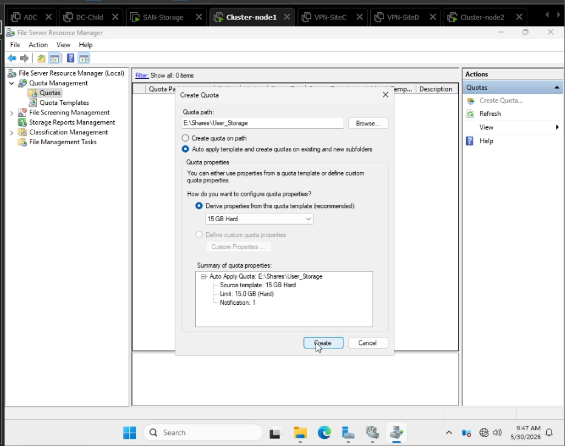

# Windows File Services & Group Policy Object (GPO) Deployment

This repository folder documents the implementation of centralized user data management, automated storage provisioning, and multi-tenant security structures orchestrated via Active Directory Domain Services (AD DS) and clustered storage backends.

---

## 🛠️ Infrastructure Architecture Components

The architecture bridges directory services and network security with high-availability infrastructure nodes:

### 1. High-Availability Storage & Folder Redirection
* **Storage Allocation:** Disk space is provisioned from dedicated LUNs on the **Oracle ZFS SAN Storage**, mounted directly onto the cluster nodes managed within the **Windows-Failover-Cluster** setup.
* **Folder Redirection:** Engineered a Group Policy Object to seamlessly redirect critical user shell paths (such as *Desktop* and *Documents*) from local workstation profiles onto the resilient clustered SAN shares.

---

### 2. Centralized Drive Mapping via GPO
* **Automated Drive Mapping:** Configured GPO Drive Preferences to dynamically mount corporate shared repositories at user logon based on their active group identity.
* **Path Enforcement:** Drives are mapped cleanly using secure UNC paths pointing back to the central file resource structure.

---

### 3. Storage Governance via FSRM Quotas
* **Role Deployment:** Deployed the **File Server Resource Manager (FSRM)** role across the cluster storage nodes.
* **Quota Enforcement:** Configured rigid hard and soft quotas per user directory to track utilization profiles and actively eliminate the risk of a single user causing SAN storage exhaustion.

---

## 🔐 Security & NTFS Advanced Permissions Matrix

To comply with enterprise privacy requirements and guarantee complete isolation between distinct user profiles during the automated creation of redirected paths, the root deployment directory utilizes a specialized access control list (ACL):

| Identity Reference | Permission Level | Inheritance | Applied To |
| :--- | :--- | :--- | :--- |
| **SYSTEM** | Full Control | Disabled | This folder, subfolders, and files |
| **Administrators** | Full Control | Disabled | This folder, subfolders, and files |
| **users-storage (Group)** | Read/Execute, Create Folders / Append Data | Disabled | This folder only |
| **CREATOR OWNER** | **Full Control** | **Disabled** | **Subfolders and files only** |

### 💡 Architectural Rationale for `CREATOR OWNER` Execution
By limiting the `users-storage` group to **"This folder only"** and assigning **Full Control** to the **`CREATOR OWNER`** on subfolders and files:
1. When a user logs in and the GPO executes, the system creates a personal folder for them under their username.
2. The user is instantly flagged as the owner of that subfolders, granting them absolute rights (**Full Control**) over their redirected files.
3. Other members of the `users-storage` group are completely blocked from reading, browsing, or accessing their colleagues' data, ensuring strict multi-tenant data privacy across the enterprise.

---

## 📋 Validation & Verification Checklist

1. **Policy Push:** Force GPO evaluation on targets using `gpupdate /force` and audit results via `gpresult /r`.
2. **Quota Violations:** Check FSRM dashboard log behaviors when user storage metrics cross the soft threshold warnings.
3. **ACL Inheritance Verification:** Ensure that child folders created by the system drop inheritance correctly and remain private to the destination account owner.
